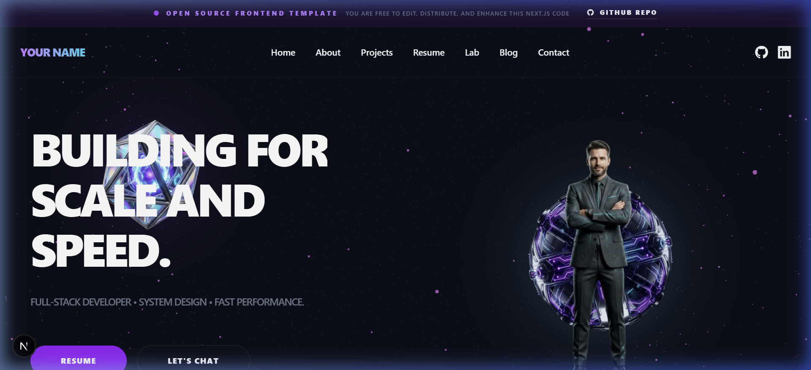
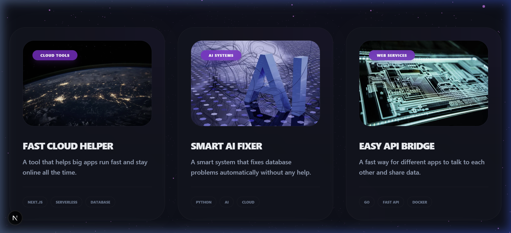
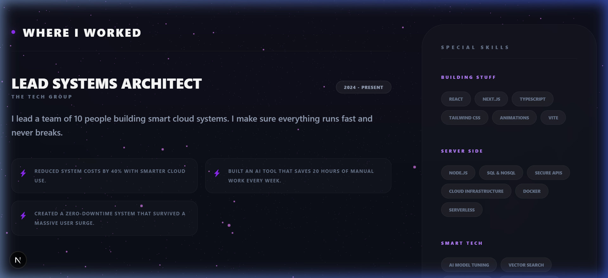
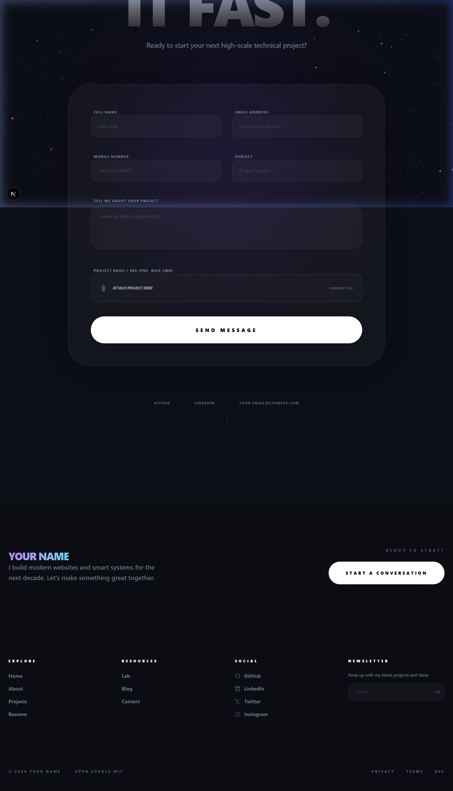

# Premium Portfolio Showcase 2026

A high-performance, human-centric, and Cloudflare-ready portfolio template built with Next.js 16 and React 19. This is an open-source project designed for modern developers and technical professionals.



## ✨ Features
- **Modern Aesthetics**: Glassmorphic UI with purple/cyan accents and smooth Framer Motion animations.
- **AI Assistant**: Programmatic chatbot for seamless site navigation and user interaction.
- **Repository-Style Projects**: Detailed project pages with technical metrics, "Clone Repo" functionality, and README-style content.
- **Responsive Design**: Fully optimized for Mobile, Tablet, and Desktop.
- **Cloudflare Ready**: Pre-configured for Cloudflare Pages with edge-runtime support and high security headers.

## 📸 Project Tour

### Projects Grid

*How to edit*: Update project data in `src/content/projects/data.json` to automatically reflect your work.

### Resume Page

*How to edit*: Modify the lists in `src/app/resume/page.tsx` to customize your work experience and skill clouds.

### Contact & Footer

*How to edit*: Configure your email recipient in `src/app/api/contact/route.ts` (if added) or update your links in `src/components/layouts/Footer.tsx`.

## 🛠️ Getting Started

1. **Clone the repository**:
   ```bash
   git clone https://github.com/Dezinet/itportfolio2026.git
   ```

2. **Install dependencies**:
   ```bash
   npm install
   ```

3. **Run the development server**:
   ```bash
   npm run dev
   ```

## 🚀 Deployment
This project is optimized for Cloudflare Pages.
1. Run `npx @cloudflare/next-on-pages` to build.
2. Link your repository to Cloudflare Pages for automatic deployments.

## 📜 License
This project is open-source. You are free to edit, distribute, and enhance this template for your personal or commercial portfolio.

---
Built with 💜 by [Dezinet](https://github.com/Dezinet)
